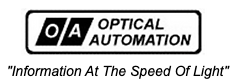

# The 'MyOneUniverse' Website Network

##### 

## Network Segway

A network wide segway is media that advertising itself and is client selectable! This allows the client to further personalize their network along with motifs additional suggested short space allow a place for your special image or media. An image of your dog, boyfriend, special car, or home can be inserted. Remember this network is designed to be private and only for your. How you present it
is up to ypu and ypu may advertise our network, so we can gain a larger client base.

## How to use 'Segways'

In the Dashboard Preferences the base segway can be changed from itself to your personal information, image, sound, movie. See Preferences to set this feature up for your pleasure and network access.

# The 'MyOneUniverse' Website Network

##### 
