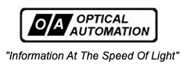

# The 'MyOneUniverse' Website Network

##### 

## My One Universe, Motif Design Shell

A motif design shell is a set of CSS3 directives to display a 'mode' and color, icon, and channel specific to a theme. Selectable themes create an 'Auro' or scent so clients can benefit from being like a popular icon such as a movie or iconic helmet.

Original [Link](https://javakian1.wixsite.com/opticalautomation-c/product-policy),

## Motif Selectors

Last Updated on March 19, 2022

Available motifs includ the following three:

1. MyOneUniverse, light, dark, standard reference. [Link](http://www.MyOneUniverse.com)
2. DetailBase, chrome, copper, or brass metallic feel. [Link](http://www.DetailBase.com)
3. MyDigitalPocketKnife, Midevil, shiny-dark, powerful. [Link](http://www.MyDigitalPocketKnife.com)

These motifs are currently a design and will be implemented on the release design deployed network website. These motifs are subject to change, but the main design is theme or shell selecctor by the client effective March 21, 2022.

"Information At The Speed Of Light"
